

## Отчет

## Практическая работа 8

## Ресурсы. Работа с медиа-элементами

---

**ФИО:** Лапшин Никита Евгеньевич  
**Курс:** 2
**Группа:** ИНС-б-о-24-1  
**Направление:** 09.03.02 «Информационные системы и технологии»  

---
### Вариант 9
### Цель работы

Изучить способы добавления и отображения графических ресурсов, научиться работать с аудио- и видеофайлами в Android-приложениях, освоить управление воспроизведением медиа-контента.

### Ход работы

  
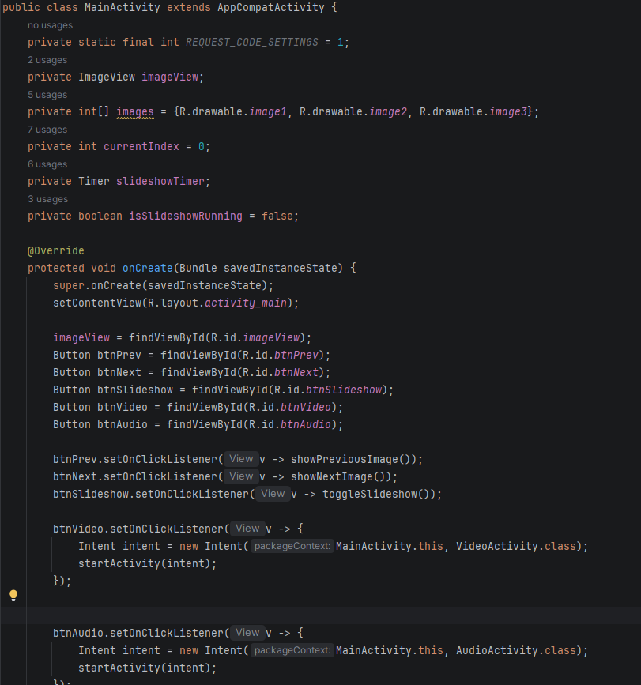

Рисунок 1 - Инициализация кнопок и слушателей

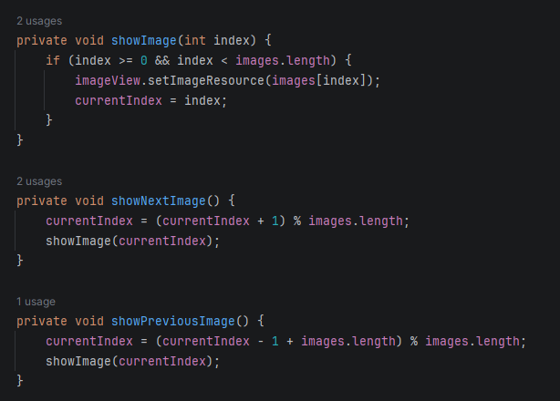

Рисунок 2 - Методы для перемещения между картинками

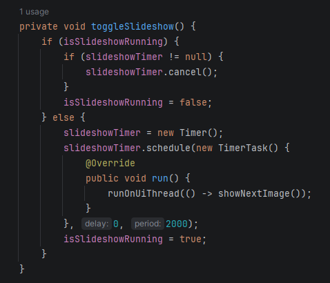

Рисунок 3 – Слайдшоу из 3-х изображений

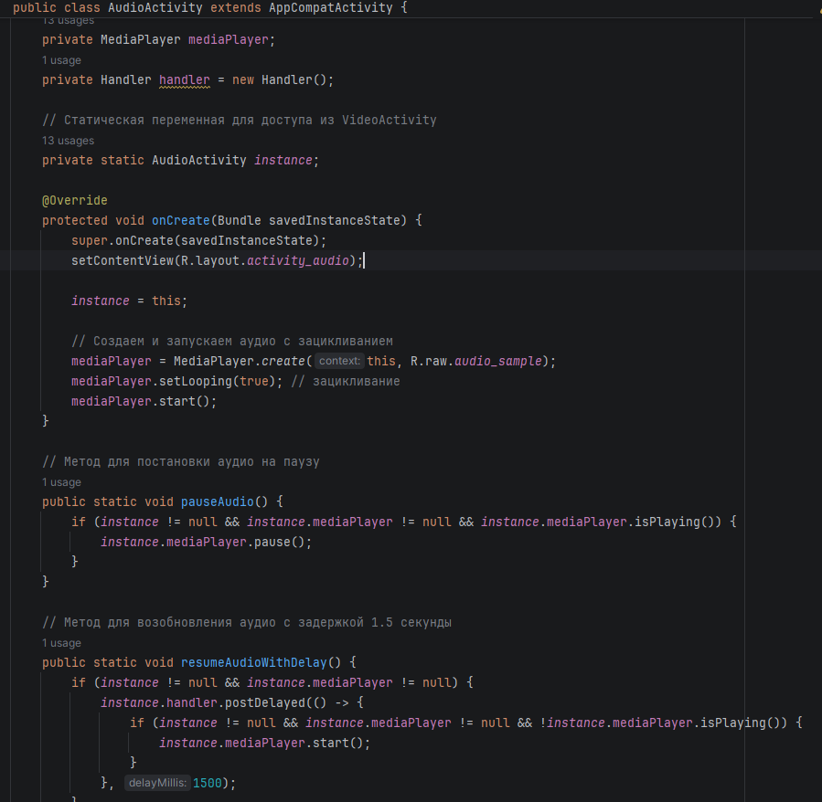

Рисунок 4 – Создание и настройка аудиоплеера в AudioActivity

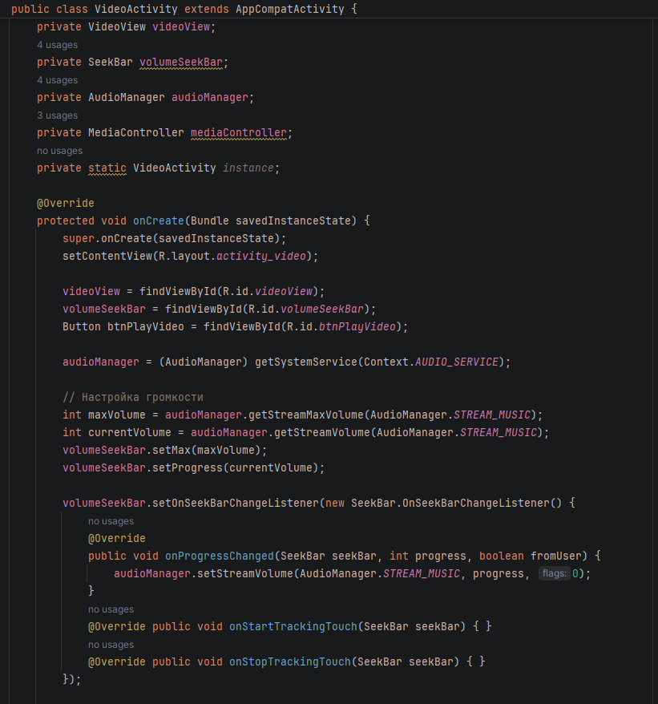

Рисунок 5 – Инициализация и настройка громкости в VideoActivity

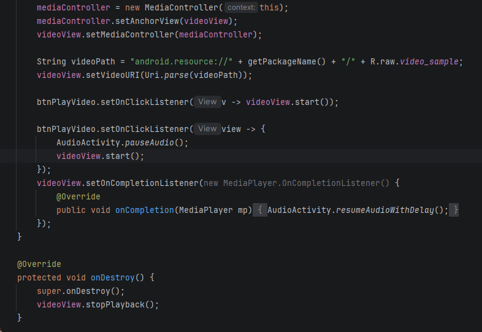

Рисунок 6 – Постановка аудиоплеера на паузу во время просмотра видео

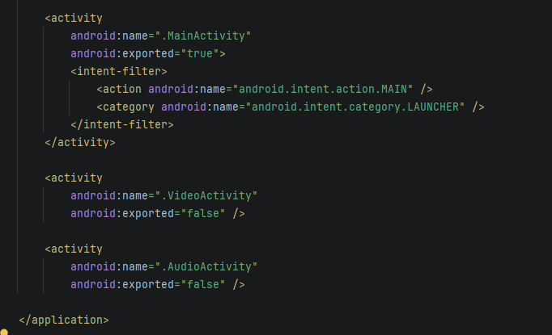

Рисунок 7 – Настройка Manifests

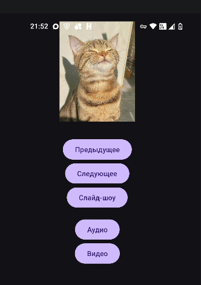

Рисунок 8 – Главный экран

Рисунок 9 – AudioActivity (воспроизведение аудио)

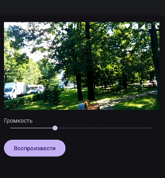

Рисунок 10 – Воспроизведение видео

## Индивидуальное задание

Задание 1. Галерея изображений

Добавьте не менее 4 изображений в папку drawable.
Реализуйте переключение изображений по кнопкам "Вперёд" и "Назад".
Добавьте кнопку "Автосмена", запускающую слайд-шоу с интервалом 3 секунды. Повторное нажатие останавливает слайд-шоу.

Задание 2. Видеоплеер
Добавьте видеофайл в папку raw.
Создайте экран с VideoView и ползунком громкости (SeekBar).
Обеспечьте возможность запуска видео, отображение стандартных элементов управления (MediaController).
Ползунок громкости должен управлять громкостью видео (и аудио, если оно играет фоном).

Задание 3. Фоновое аудио с приоритетами
Добавьте аудиофайл в папку raw.
При запуске приложения аудио начинает воспроизводиться фоном (с зацикливанием).
При переходе к видеоплееру (или при начале воспроизведения видео) аудио ставится на паузу.
После остановки видео аудио возобновляется через 1.5 секунды.
После завершения аудио (если не зациклено) оно должно начаться сначала.

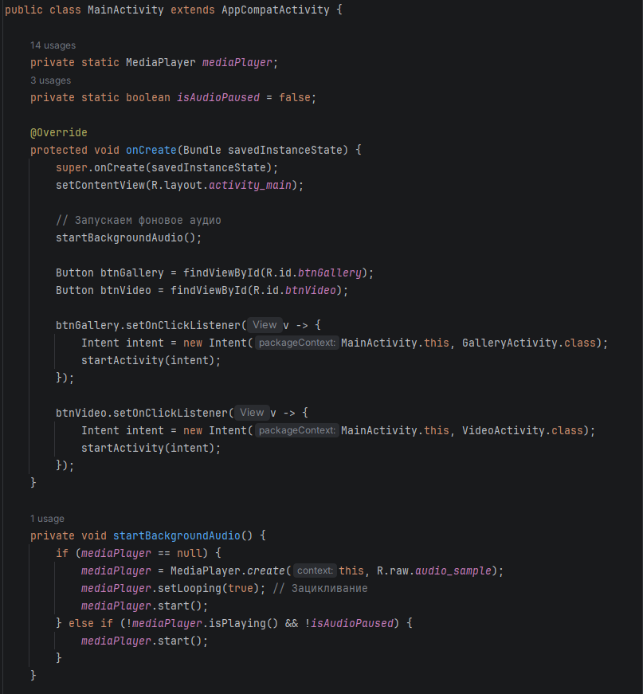

Рисунок 11 - Инициализация слушателей и запуск аудио при запуске приложения

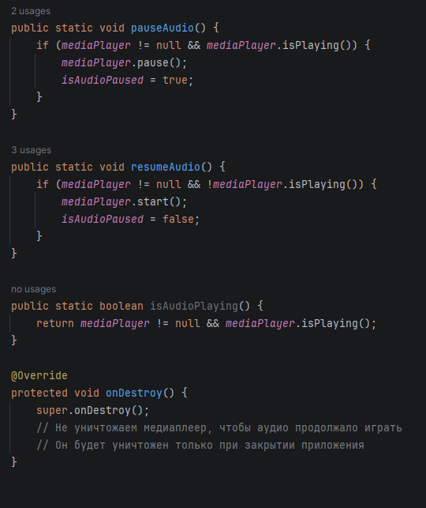

Рисунок 12 - Пауза и воспроизведение аудио

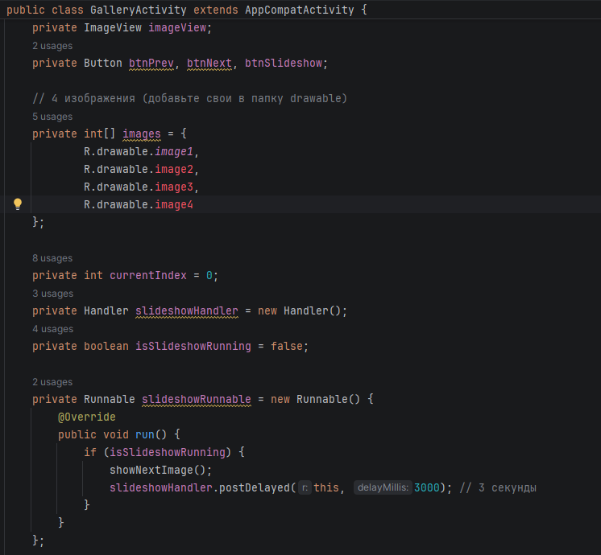

Рисунок 13 - Инициализация изображений и метод слайдшоу

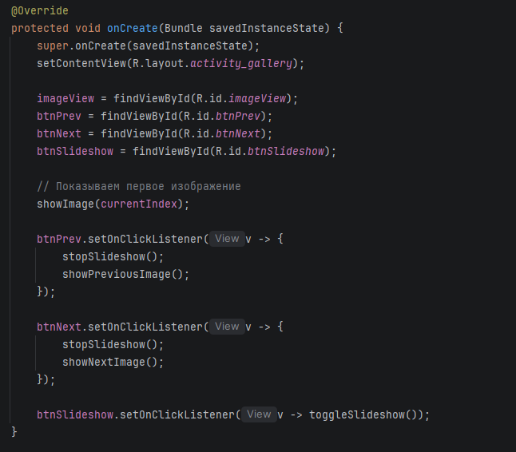

Рисунок 14 - Инициализация кнопок и слушателей

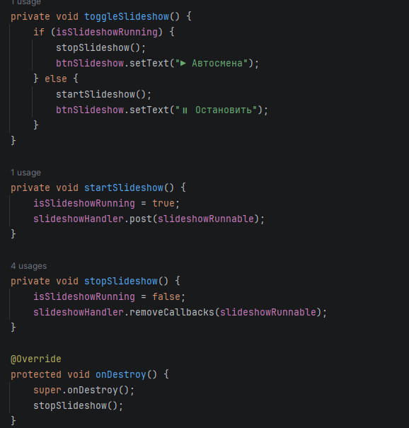

Рисунок 15 - Перелистывание изображений

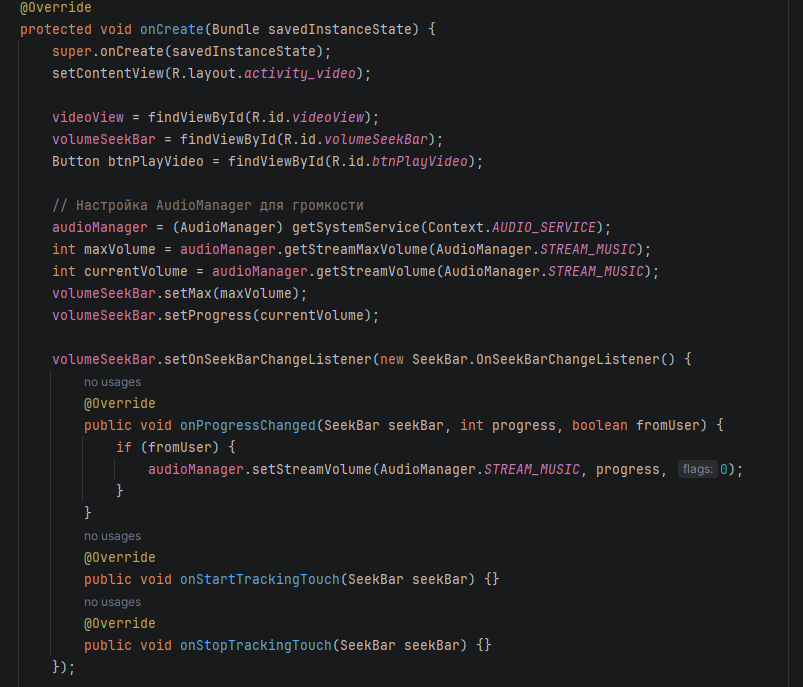

Рисунок 16 - Настройка слайдшоу

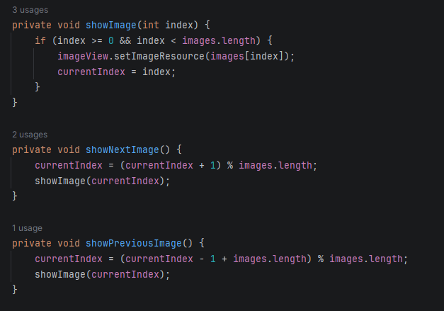

Рисунок 17 - Настройка громкости в VideoActivity

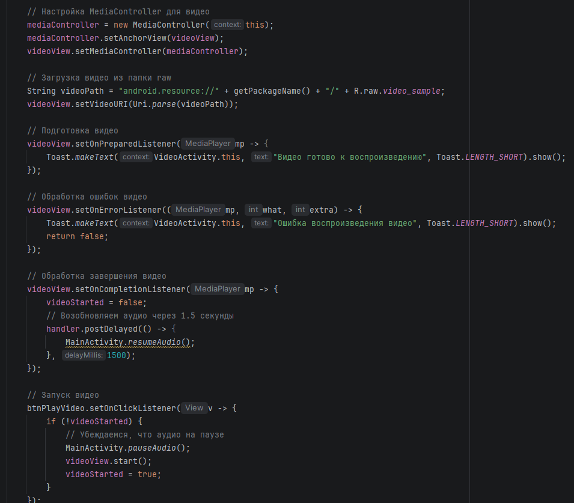

Рисунок 18 - Подготовка и обработка видео

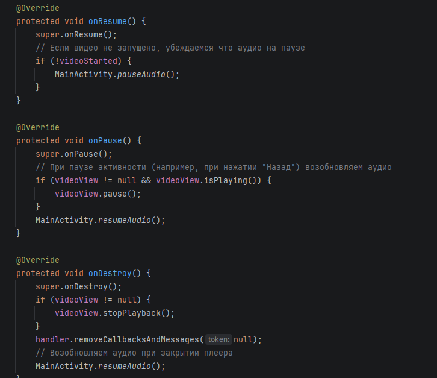

Рисунок 19 - Пауза и продолжение аудио при просмотре видео

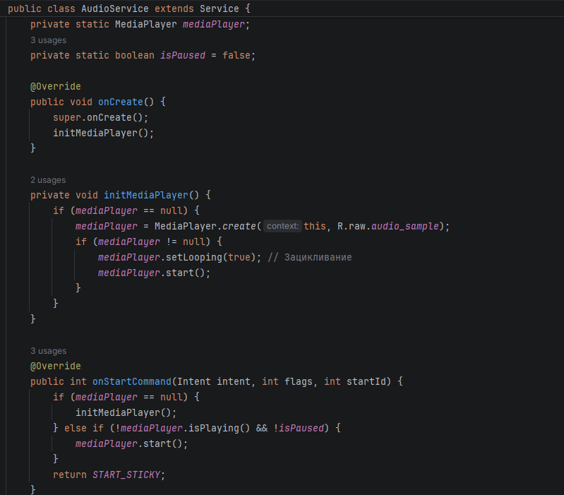

Рисунок 20 - Зацикливание аудио и проверка на видео

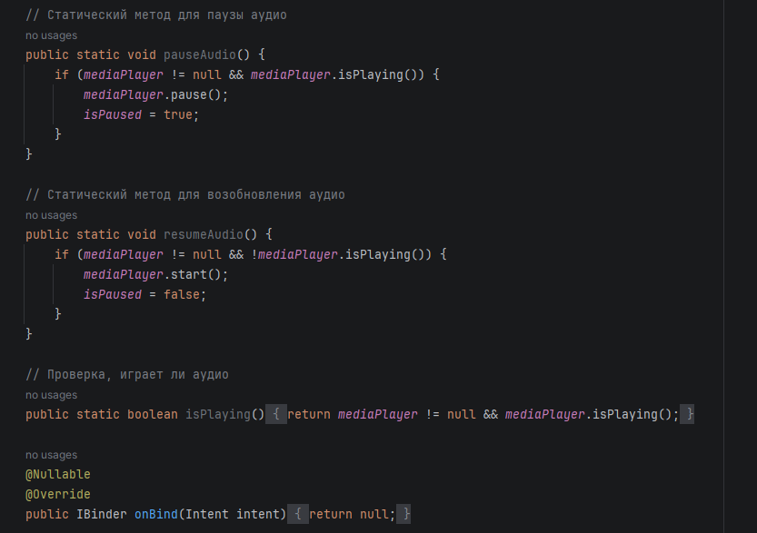

Рисунок 21 - Методы для воспроизведения аудио и проверка на воспроизведение

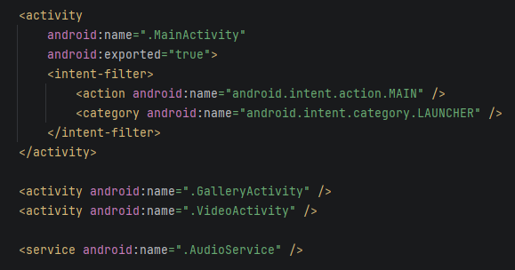

Рисунок 22 - Настройка Manifests

Рисунок 23 - Главный экран

Рисунок 24 - Галерея

Рисунок 25 - Видеоплеер
## Контрольные вопросы:
1. Типы ресурсов: drawable (изображения, формы), raw (сырые файлы, например, аудио), values (строки, цвета, размеры, стили).
2. Добавить изображение в ImageView:
Из ресурсов: imageView.setImageResource(R.drawable.my_image);
Из файловой системы: imageView.setImageBitmap(BitmapFactory.decodeFile("/sdcard/image.png"));
3. Жизненный цикл MediaPlayer: Создание → setDataSource() → prepare() → start() → pause/stop → release(). Для файла из ресурсов: MediaPlayer.create(context, R.raw.sound) (объединяет подготовку) → start().
4. AudioManager: Управление громкостью и режимами звука. Получение: (AudioManager) getSystemService(Context.AUDIO_SERVICE). Изменить громкость: audioManager.setStreamVolume(AudioManager.STREAM_MUSIC, value, 0);
5. VideoView + MediaController: VideoView — виджет для видео. MediaController — панель управления. Связка: mediaController.setAnchorView(videoView); videoView.setMediaController(mediaController); videoView.setVideoPath(path); videoView.start();
6. runOnUiThread() в TimerTask: Таймер работает в фоновом потоке, а UI обновляется только из главного потока. runOnUiThread(() -> seekBar.setProgress(...));
7. Зацикливание аудио: mediaPlayer.setLooping(true); или в MediaPlayer из ресурсов после создания вызвать этот метод.
8. Разрешения для медиа:
Android ≤ 10: android.permission.READ_EXTERNAL_STORAGE
Android ≥ 10 (Scoped Storage): android.permission.READ_MEDIA_AUDIO, READ_MEDIA_VIDEO, READ_MEDIA_IMAGES
Android ≤ 4.4 и запись: WRITE_EXTERNAL_STORAGE
